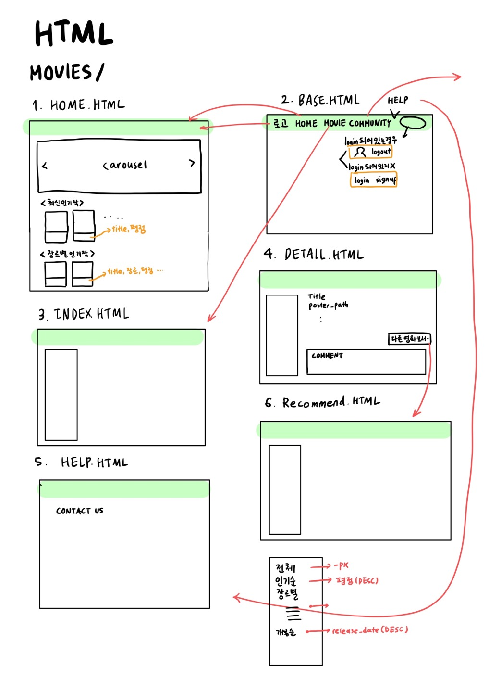
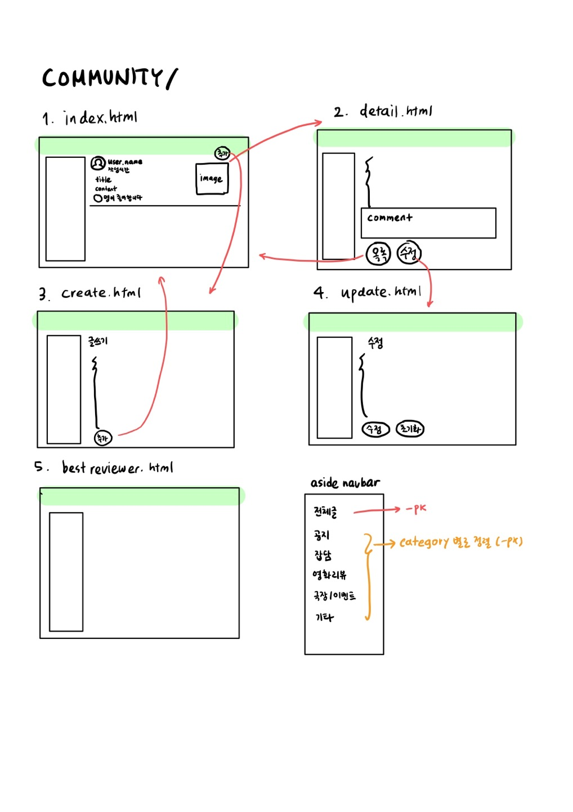
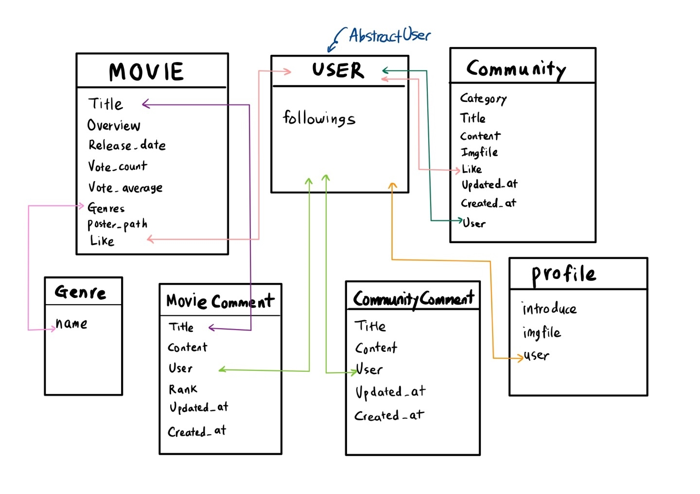

# FINAL PJT👩‍💻🧑‍💻

🎶지하와 지은이가 함께하는 마지막 PJT🎶


[TOC]

## PRE-PROJECT

* 아이디어 구상(어떤 프로젝트 만들까?)
  * 영화를 함께 보러갈 수 있는 pair 구하기
    * 과연 실시간 채팅 구상 가능할까? -> 아직은 무리..
  * 영화 커뮤니티 기능 
    * 지금까지 pjt보다 멋지고 이쁘게 구현(카테고리고 만들고!)
    * 영화 추천 알고리즘 구현!


## PROJECT

* 주제
  * 영화 커뮤니티 생성
* 구현하고 싶은 기능
  * 로그인/ 로그아웃
  * 영화 커뮤니티로 영화인들간의 소통
  * 리뷰 작성
  * 영화 추천 알고리즘
* 역할 분담
  * 다같이
    * model, serializer, form 짜기
    * API 불러오기(from TDMB)
  * 지하(백엔드 최강자)
    * url, view 작성
  * 지은(프론트 대마왕)
    * template, readme 작성
* 일정
  * 22.05.20
    * model 구현하기
  * 22.05.23~22.05.24
    * urls, views, html 완성
  * 22.05.25~22.05.26
    * 욕심내고 싶은거 직접 구현
    * random이 아닌 다른 추천 알고리즘 구현
    * rank 이쁘게 구현
  * 22.05.27
    * **최종 제출!!**


## FINAL_PJT

### 스프레드시트에 html, url, view 구상

[기본 구상 스프레드시트](https://docs.google.com/spreadsheets/d/1uVgld1AOmg0s9EK6qEOTVoBboNhX8l74dx1EaDPdu04/edit#gid=0)


### 페이지 구상






### ERD(모델구상)




### RECOMMEND 알고리즘 설명

```
movie의 가장 큰 핵심은 장르라고 생각!
따라서 지금 선택한 영화와 같은 장르의 영화 중에서 추천하는 방법을 선택!

1. 같은 장르더라도 이미 후기를 남긴 작품은 제외!

2. 동일한 장르 태그를 가지고, 후기가 없으며, 평점이 높은 영화 목록중 3개를 가져옴

3. 만약 가져온 영화가 3개보다 적다면, 무작위 영화를 뽑아서 3개를 가져옴 (따라서 최종 데이터는 항상 3개)
```


### 실제 사이트 구현 정도 & 필수 기능에 대한 설명

```
1. 로그인, 로그아웃 구현
2. 영화 설명과 커뮤니티 페이지 구현
3. 영화 카테고리별 분류(전체, 인기순, 개봉순)
4. 영화에 대한 평점 수정/삭제/작성 가능 - 댓글 기능
5. 영화 상세보기에서 이 영화와 비슷한 다른 영화 추천 받기 가능
6. 커뮤니티 카테고리별 분류
7. 커뮤니티 카테고리 글의 개수 시각화
8. 커뮤니티 게시글의 좋아요 및 좋아요 숫자 표시
9. 커뮤니티 게시글 작성자만 글 수정, 글 삭제 가능
10.커뮤니티 게시글에 대한 댓글 등록 가능 - 댓글 작성자만 수정, 삭제 가능
11.글과 댓글의 작성시간 수정시간 확인 가능
12.사용자 간 팔로우, 팔로워 가능
13.사용자가 작성한 게시글들을 프로필에서 따로 확인 가능
```


## 개발일지

### DAY1

22.05.20

* 오늘 한 일
  * 다같이
    * skeleton 코드 작성(models, forms, 기본 html)
    * 기본 ERD 그리기
    
  * 지하 - url,view 구상
    * movies의 view에서 tmdb API를 연동해서 데이터 받아오기
    * return 값으로 영화 정보와 포스터 경로를 따로 보내서 안전하게 사진 받아오기
    
    ```python
    # movies/views.py
    from django.shortcuts import render
    from django.views.decorators.http import require_GET
    import requests
    
    API_KEY = 'de0229aeb70f2e7ae9e8c265ae41d6f3'
    #BASE_URL = 'https://api.themoviedb.org/3/movie/top_rated'
    BASE_URL = 'https://api.themoviedb.org/3/'
    IMAGE_URL = 'https://image.tmdb.org/t/p/original'
    
    def get_movie(request):
        params = {
            'api_key' : API_KEY,
            # 'page' : 1,
            'language' : 'ko',
        }
        response = requests.get(BASE_URL + 'movie/top_rated', params = params).json()
        movie_list = response.get('results')
        return movie_list
    
    @require_GET
    def index(request):
        movies = get_movie(request)
        context = {
            'movies': movies,
            'IMAGE_URL': IMAGE_URL,
        }
        return render(request, 'movies/home.html', context)
    ```
    
  * 지은 - html 구상
  
    * 1. 페이지 구상에 넣어놓기!
  
* 어려웠던 점
  * 어떤 페이지로 넘어가야할지 구상하는 것이 어려웠음 ㅠㅠ
  * 페이지 기본 구상을 직접 그려봐야겠다!

____

### DAY2

22.05.23

* 오늘 한일

  * 지하
    * 데이터 seed 생성기 만들기
    * views, urls 끝내기
    * movie recommend 구현
  * 지은
    * html 완성(views에서 넘어온 정보들을 가지고 html 굴러가게끔 전부 완료!)
    * forms 완성
    * static에 필요한 png, jpeg 넣고 이미지 구성

* 어려웠던 점

  * 지하

    * 데이터 seed 만드는 django 파일을 하나 더 만듦

    ```python
    from django.shortcuts import render
    from .models import Movie, Genre
    import requests, json
    from django.core.management import call_command
    
    # 해당 주소로 요청을 보내면 json 파일을 받을 수 있음
    API_KEY = 'de0229aeb70f2e7ae9e8c265ae41d6f3'
    #BASE_URL = 'https://api.themoviedb.org/3/movie/top_rated'
    BASE_URL = 'https://api.themoviedb.org/3/'
    IMAGE_URL = 'https://image.tmdb.org/t/p/original'
    movies_fixture = 'data/fixtures/movies.json'
    genres_fixture = 'data/fixtures/genres.json'
    
    # Create your views here.
    # 영화 정보를 가지고 오는 함수
    # 매개변수로 page가 있음
    def get_movie(page):
        # 빈 리스트
        movie_list = []
        # 한페이지당 영화 20개씩이라 영화 50개 이상 받기 위해 for문 돌림
        for p in range(1,page+1):
            # tmdb에서 요구하는 필수 인자값
            params = {
                'api_key' : API_KEY,
                'page' : f'{p}',
                'language' : 'ko',
            }
            # 결과값을 result만 받아오겠다!
            response = requests.get(BASE_URL + 'movie/top_rated', params = params).json().get('results')
            
            # 우리가 쓸 수 있는 형태의 파일로 만들기!
            # models 참고!
            for movie in response:
                movie_dict = {
                    "model": "movies.movie",
                    "fields": {
                        "poster_path": IMAGE_URL + movie.get('poster_path'),
                        "overview": movie.get('overview'),
                        "title": movie.get('title'),
                        "vote_count": movie.get('vote_count'),
                        "vote_average": movie.get('vote_average'),
                        "genres": movie.get('genre_ids'),
                    }
                }
                # 개봉일이 없는 경우, 특정값으로 고정!
                if not movie.get('release_date'):
                    movie_dict['fields']['release_date'] = "1000-01-01"
                else:
                    movie_dict['fields']['release_date'] = movie.get('release_date')
                movie_list.append(movie_dict)
        return movie_list
    
    # 장르도 위에 있는 것과 구조 동일!
    def get_genres():
        result = []
        
        params = {
            'api_key': API_KEY,
            'language': 'ko',
        }
    
        response = requests.get(BASE_URL + 'genre/movie/list', params = params).json().get('genres')
    
        for genre in response:
            genre_dict = {
                "model": "movies.genre",
                    "pk": genre.get('id'),
                    "fields": {
                        "name": genre.get('name'),
                    }
            }
            result.append(genre_dict)
        return result
    
    # 영화 데이터를 다 가지고 오게 하는 main 함수
    def index(request):
        #genres = requests.get('https://api.themoviedb.org/3/genre/movie/list?api_key=82fd037e84e453b9ff4e74d5eb529e7f&language=ko-KR').json().get('genres')
        # 데이터 호출
        movie_data = Movie.objects.all()
        # 데이터가 비어있다면 data/fixtures/genres.json을 열어서 get_genres()에 있는 json파일 덮어쓰기 
        if not movie_data:
            with open('data/fixtures/genres.json', 'w', encoding="UTF-8") as f:
                json.dump(get_genres(), f, ensure_ascii=False, indent=2)
            
            # call_command('loaddata', genres_fixture, app_label='movies')
            
            # 데이터가 비어있다면 data/fixtures/movies.json을 열어서 get_genres()에 있는 json파일 덮어쓰기 
            with open('data/fixtures/movies.json', 'w', encoding="UTF-8") as f:
                # page가 4로 설정하여 총 20 x 4 = 80개의 영화를 가져옴
                json.dump(get_movie(4), f, ensure_ascii=False, indent=2)
    
            # call_command('loaddata', movies_fixture, app_label='movies')
        
            movie_data = Movie.objects.all()
    
        context = {
            'movies': movie_data,
            'IMAGE_URL': IMAGE_URL,
        }
        return render(request, 'data/home.html', context)
    ```

    fixtures에 json 파일을 넣어서 movies/fixtures/movies.json, movies/fixtures/genres.json을 loaddata 함!

    

  * 지은

    * javascript너무 어려움,, 그래서 html을 만들어 정렬하는 카테고리 생성!
    * aside navbar 가 상단의 navigation을 잡아먹음  => 가로로 생긴 navbar를 한개 더 생성

* 내일 해야 될 일
  * recommend 새로운 방법 알고리즘 구현
  * HTTP response status codes로 에러페이지 구현
  * UX, UI 최대한 이쁘게 꾸미기

____

### DAY3

22.05.24

* 오늘 한 일

  * 지하

    * recommend 조금 더 구체적이게 기획

    ```
    # movies/views.py에서 구상
    
    movie의 가장 큰 핵심은 장르라고 생각!
    따라서 지금 선택한 영화와 같은 장르의 영화 중에서 추천하는 방법을 선택!
    
    1. 같은 장르더라도 이미 후기를 남긴 작품은 제외!
    
    2. 동일한 장르 태그를 가지고, 후기가 없으며, 평점이 높은 영화 목록중 3개를 가져옴
    
    3. 만약 가져온 영화가 3개보다 적다면, 무작위 영화를 뽑아서 3개를 가져옴 (따라서 최종 데이터는 항상 3개)
    ```

  * 지은
    * accouns 앱 안에 있는 html 완성
    * login 모달 폼 구현
      * 모달 폼은 구현했지만 로그인 페이지로 바로 넘어가지 않음 => 다시 확인 필요
    * movies, community의 index의 card 더 예쁘게 꾸미기(구글폰트 추가)
    * 사용할 사진들 flaticon에서 모아서 static 폴더 내에 넣기

* 알게 된 것

  * css 파일을 html 안에 넣으면 너무 기니까 static에 넣고 

    ```html
    <head>
    
    <link rel = "stylesheet" href = ""
    </head>
    ```

    에 넣기!

  * 모달 폼 구현하기 위해서는 `<body>`내에서 `<div>` 전부 밖에 넣기!

    안 그러면 페이지 안 움직이는 것이 모달 폼을 잡아먹어서 아무것도 눌리지 않음

* 아직도 모르겠는 점

  * 이미지 파일 첨부하는 것 도대체 어떻게 하는거야,,,

    전부 다 해봤는데 DB에 아예 URL이 저장이 안됨

  * accounts/profile에서 follow/unfollow 누르면 팔로우 되게끔 ! 조금만 더 하면 될 듯

  * 로그인 모달폼의 login을 누르면 바로 페이지로 넘어가는 것이 아니라 userform의 login으로 다시 넘어감...

___

### DAY4

22.05.25

* 오늘 한 일
  * 다같이
    * PPT 시작!
  * 지하
    * 로그인 모달 완성
    * 파일 첨부 가능하게 하기
  * 지은
    * PROFILE 페이지 완성
    * 이쁘게 꾸미기
  
* 알게 된 것
  * 로그인 모달 연결
  
  ```python
  # accounts/views.py에서 모달폼에서 받아온 거 저장해야함!
  from django.contrib.auth import authenticate
  
  @require_http_methods(['GET', 'POST'])
  def login(request):
      if request.user.is_authenticated:
          return redirect('movies:home')
  
      if request.method == 'POST':
          form = AuthenticationForm(request, request.POST)
          # 여기부분! 로그인 모달에서 받아온 내용들 받아오기
          id = request.POST['username']
          pwd = request.POST['password']
          user = authenticate(username=id, password=pwd)
          if form.is_valid():
              auth_login(request, user)
              return redirect(request.GET.get('next') or 'movies:home')
      else:
          form = AuthenticationForm()
      context = {
          'form': form,
      }
      return render(request, 'accounts/login.html', context)
  ```
  
  
  
  * 이미지 파일 첨부 가능하게 하는 방법 - update까지 가능
  
  ```python
  # community/urls.py
  urlpatterns = [
      
  ] + static(settings.MEDIA_URL, document_root=settings.MEDIA_ROOT)
  ```
  
  ```python
  # community/models.py
  imgfile = models.ImageField(null=True, upload_to="", blank=True)
  ```
  
  ```html
  <!--movies/create.html-->
  
  <form action="" method="POST" enctype="multipart/form-data">
    
    {{form.as_p}}
    <div class = "container">
      <div class = "d-flex justify-content-end">
        <input type= "submit" value = "글 등록">
      </div>
    </div>
  </form>
  ```
  
  ```python
  # community/views.py
  
  @login_required
  @require_http_methods(["GET", "POST"])
  def update(request, community_pk):
      community = get_object_or_404(Community, pk=community_pk)
  
      if request.method == 'POST':
          # update할 때는 files에서 받아와야함!
          form = CommunityForm(request.POST, files=request.FILES, instance=community)
          if form.is_valid():
              form.save()
              return redirect('community:detail', community.pk)
      else:
          form = CommunityForm(instance=community)
      context = {
          'form': form,
          'community': community,
      }
      return render(request, 'community/update.html', context)
  ```
  
  * 구글 폰트 사용법, 부트스트랩 이용
  
* 아직도 모르겠는 점
  * 회원가입 모달,,,pwd2의 진짜 이름을 모르겠음,, 
  * 댓글 수정 구현 .. 해볼ㄲ..?
  
* 내일 해야되는 일
  * PPT 완성
  * README.md 완성
  * 마지막으로 시연 해보기

___

### DAY5

22.05.26

* 오늘 한 일
  * profile에 소개글 작성/ 수정/ 삭제할 수 있는 기능 추가
  * profile에 사진 첨부 가능하게 하는 기능 추가
  * 영화에 대한 평점을 ⭐ 로 보이게 !
  * 로그인 모달과 회원가입 폼 이쁘게 꾸미기!
  * PPT완성
  * 마지막으로 프로젝트 작동하는지 확인
  * 파일 제출 완료~


## 최종 확인!

필수적으로 해야되는 일을 했는지 마지막으로 확인🤭

* 관리자 뷰 
  - [x] 관리자 권한의 유저만 영화 등록 / 수정 / 삭제 권한을 가집니다.
  - [x] 관리자 권한의 유저만 유저 관리 권한을 가집니다.
  - [x] Django에서 기본적으로 제공하는 admin 기능을 이용하여 구현합니다.

* 영화 정보
  - [x] 영화 데이터는 Database Seeding을 활용하여 최소 50개 이상의 데이터가 존재하도록 구성해야 합니다. 
  - [x] 로그인 된 유저는 영화에 대한 평점 등록 / 수정 / 삭제 등을 할 수 있어야 합니다.
* 영화 추천 알고리즘
  - [x] 영화를 평가한 유저는 해당 정보를 기반으로 영화를 추천 받을 수 있어야 합니다.
  - [x] 추천 알고리즘의 지정된 형식은 없으나, 사용자는 반드시 최소 1개 이상의 방식으로 영화를 추천 받을 수 있어야 합니다.
  - [x] 추천 방식은 각 팀별로 자유롭게 선택할 수 있으며, 어떠한 방식으로 추천 시스템을 구현 했는지 기술적으로 설명할 수 있어야 합니다.
* 커뮤니티
  - [x] 영화 정보와 관련된 소통을 할 수 있는 커뮤니티 기능을 구현해야 합니다.
  - [x] 로그인 사용자만 글을 조회 / 생성 할 수 있으며, 작성자 본인만 글을 수정 / 삭제 할 수 있습니다.
  - [x] 사용자는 작성된 게시 글에 댓글을 작성할 수 있어야 하며 작성자 본인만 댓글을 삭제할 수 있습니다.
  - [x] 각 게시글 및 댓글은 생성 및 수정 시각 정보가 포함되어야 합니다.
* 기타
  - [x] 최소한 5개 이상의 URL 및 페이지를 구성해야 합니다.
  - [x] HTTP Method와 HTTP response status codes는 상황에 맞게 적절하게 반환되어야 하며, 필요에 따라 메시지 프레임워크 등을 사용하여 에러 페이지를 구성해야 합니다.


## 프로젝트를 마치며!

지하

```
seed-data 생성기 제작이 생각보다 어려웠는데 만들고 보니 나름 재밌습니다.
모델을 여러번 갈아 엎는 과정이 있어서 처음에 모델링을 똑바로 해야겠습니다.
프론트에 자신이 많이 없어서 백을 하기로 했는데 정작 자잘한 오타와 에러까지 많이 떠서 발등에 불 떨어졌습니다.
프론트 대마왕이 없었으면 혼자서 네모상자 가지고 한참이나 씨름할 것 같은데 다행이라고 생각합니다..
마지막으로 추천 알고리즘이 되게 단순하다 생각할 수 있는데 인터넷에 나오는 추천알고리즘은 코딩이 문제가 아니라 제가 이해를 못해서 못한겁니다. 아무튼 그런겁니다.
```


지은

```
프론트는 이쁘게 꾸미기만 하면 되는 건 줄 알았는데 더 예쁘게 꾸미기 위해서는 백엔드 기술도 열심히 공부해야 한다는 것을 깨달았습니다..
처음에는 장고도 버거웠지만 이제는 장고를 활용해서 웹 페이지를 꾸밀 수 있다는 것에 뿌듯했고, 뷰와 자바스크립트도 배울 땐 너무 어렵고 여전히 구현하기 어렵지만 방학 동안 열심히 공부하면 더 예쁜 웹페이지를 꾸밀 수 있다는 자신감이 생겼습니다!.
총 10회에 걸친 PJT를 많이 참고했는데 확실하게 제 것으로 만든 기회가 된 것 같습니다!
```

